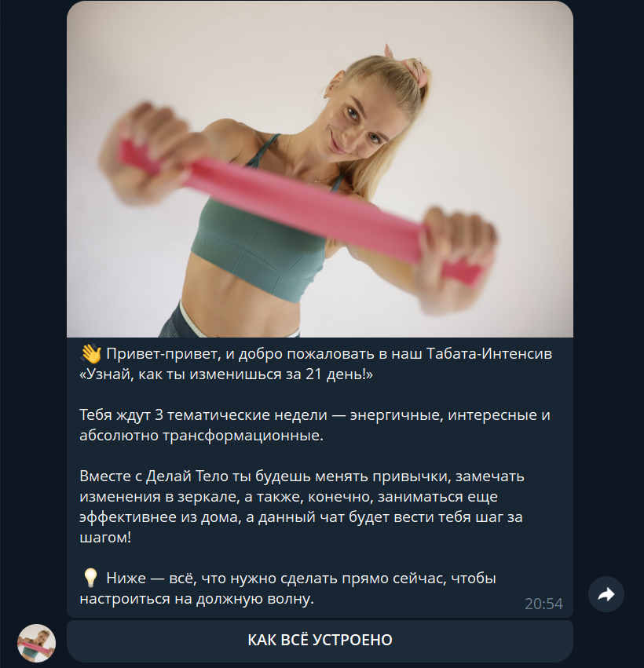

# 🏋️‍♀️ Telegram Bot - Табата-Интенсив

Telegram-бот для проведения 21-дневного фитнес-интенсива с системой геймификации, автоматическим открытием дней, отслеживанием прогресса и генерацией персонализированных сертификатов.


---

## 📋 Содержание

- [Описание](#описание)
- [Возможности](#возможности)
- [Технологии](#технологии)
- [Структура проекта](#структура-проекта)
- [Установка](#установка)
- [Настройка](#настройка)
- [Запуск](#запуск)
- [База данных](#база-данных)
- [Скриншоты](#скриншоты)
- [Развертывание на сервере](#развертывание-на-сервере)

---

## 📖 Описание

Бот управляет 21-дневным интенсивом с автоматическим открытием контента по расписанию. Участники выполняют тренировки, получают достижения, отслеживают прогресс и в конце получают персональный сертификат.

**Основные особенности:**
- 🤖 Полностью автоматизированный процесс
- 📅 Автоматическое открытие нового дня в 09:00
- 🎯 Система геймификации (баллы, достижения)
- 📊 Отслеживание прогресса в реальном времени
- 🎓 Генерация персонализированных сертификатов
- 📸 Сравнение фото "До" и "После"
- 🎁 Автоматическая выдача промокодов

---

## ✨ Возможности

### 🎮 Геймификация
- **Система баллов**: +1 балл за каждую тренировку и задание
- **9 достижений**: от "🔥 Старт" до "🎉 100% выполнение"
- **Прогресс-бар**: визуализация прохождения интенсива
- **Еженедельные челленджи**: 3 тематические недели

### 📱 Интерактивность
- Кнопки быстрых действий: "✅ ВЫПОЛНИЛА", "✍️ СДЕЛАНО", "❌ ПРОПУСКАЮ"
- Персонализированное меню с профилем пользователя
- Просмотр своих фото "До" и "После"
- Расписание с доступом к пройденным дням

### 🎓 Финальный этап
- Загрузка фото "До" и "После"
- Автоматическая проверка выполнения всех заданий
- Генерация сертификата с именем участника
- Отправка мотивационного сообщения со сравнением фото
- Выдача промокода на скидку

### ⏰ Автоматизация
- Ежедневное открытие нового дня в 09:00
- Напоминания о новом контенте
- Проверка выполнения еженедельных челленджей
- Автоматическая выдача достижений

---

## 🛠 Технологии

| Технология | Версия | Назначение |
|-----------|--------|------------|
| **Python** | 3.11+ | Основной язык |
| **aiogram** | 3.22.0 | Telegram Bot Framework |
| **SQLite** | 3 | База данных |
| **APScheduler** | 3.11.0 | Планировщик задач |
| **Pillow** | 11.3.0 | Генерация изображений |
| **aiofiles** | 24.1.0 | Асинхронная работа с файлами |

---

## 📁 Структура проекта

```
telegram-tabata-bot/
│
├── bot.py                      # Главный файл запуска бота
├── config.py                   # Конфигурация (токен, пути, настройки)
├── database.py                 # Работа с SQLite (CRUD операции)
├── keyboards.py                # Клавиатуры и кнопки
├── content.py                  # Контент 22 дней интенсива
├── certificate_generator.py    # Генерация сертификатов
├── scheduler.py                # Планировщик (автооткрытие дней)
│
├── handlers/                   # Обработчики команд и callback
│   ├── __init__.py
│   ├── start.py               # День 0, регистрация
│   ├── days.py                # Логика всех 22 дней
│   ├── menu.py                # Меню, прогресс, профиль
│   └── progress.py            # Отслеживание прогресса
│
├── Табата-Интенсив/           # Медиа-файлы
│   ├── Фото 1.png - Фото 12.png
│   ├── День 1 - Табата.mp4
│   ├── Гайд Интенсива.pdf
│   └── ...
│
├── certificates/              # Сгенерированные сертификаты
├── Sertificate.png           # Шаблон сертификата
├── tabata_bot.db             # База данных SQLite
│
├── requirements.txt          # Зависимости Python
├── README.md                 # Документация
└── .gitignore               # Игнорируемые файлы
```

---

## 🚀 Установка

### 1. Клонирование репозитория

```bash
git clone https://github.com/ваш-username/telegram-tabata-bot.git
cd telegram-tabata-bot
```

### 2. Создание виртуального окружения

**Windows:**
```bash
python -m venv venv
venv\Scripts\activate
```

**Linux/Mac:**
```bash
python3 -m venv venv
source venv/bin/activate
```

### 3. Установка зависимостей

```bash
pip install -r requirements.txt
```

### 4. Требования к системе

- **Python**: 3.11 или выше
- **ОЗУ**: минимум 512 MB
- **Диск**: 1 GB (для медиа-файлов и БД)
- **ОС**: Windows 10+, Ubuntu 20.04+, macOS 10.15+

---

## ⚙️ Настройка

### 1. Получение токена бота

1. Найдите [@BotFather](https://t.me/BotFather) в Telegram
2. Создайте нового бота командой `/newbot`
3. Скопируйте полученный токен

### 2. Настройка `config.py`

Откройте `config.py` и укажите:

```python
# Токен бота
BOT_TOKEN = "ваш_токен_здесь"

# ID канала с видео (для пересылки)
VIDEO_CHANNEL_ID = -1001234567890

# Промокод (опционально)
PROMO_CODE = "TABATA25"
PROMO_DESCRIPTION = "Скидка 25% на индивидуальную программу"
```

### 3. Настройка медиа-файлов

#### Загрузка видео в канал:

1. Создайте приватный Telegram-канал
2. Добавьте бота как администратора
3. Загрузите все видео тренировок
4. Получите ID сообщений и добавьте в `config.py`:

```python
VIDEO_MESSAGE_IDS = {
    1: 2,      # День 1 - Табата
    3: 3,      # День 3 - Руки и пресс
    5: 4,      # День 5 - Ягодицы
    # ...
}
```

**Как получить ID канала:** [GET_MESSAGE_IDS.md](GET_MESSAGE_IDS.md)

#### Проблемные фото:

Если какие-то фото не отправляются (ошибка `PHOTO_INVALID_DIMENSIONS`), загрузите их в канал и добавьте в `config.py`:

```python
PHOTO_MESSAGE_IDS = {
    1: 15,     # Фото 1
    11: 16,    # Фото 11
}
```

**Подробнее:** [FIX_PHOTOS.md](FIX_PHOTOS.md)

### 4. База данных

База данных создается автоматически при первом запуске.

**Схема БД:**
- `users` - пользователи
- `progress` - прогресс по дням
- `achievements` - достижения
- `photos` - фото "До" и "После"
- `certificate_names` - имена для сертификатов

---

## ▶️ Запуск

### Локальный запуск

```bash
# Активируйте виртуальное окружение
venv\Scripts\activate  # Windows
source venv/bin/activate  # Linux/Mac

# Запустите бота
python bot.py
```

Бот запустится и начнет принимать команды!

### Проверка работы

1. Найдите вашего бота в Telegram
2. Отправьте `/start`
3. Пройдите регистрацию (День 0)

---

## 💾 База данных

### Структура таблиц

#### **users**
```sql
user_id INTEGER PRIMARY KEY
username TEXT
first_name TEXT
last_name TEXT
registration_date TIMESTAMP
current_day INTEGER DEFAULT 0
```

#### **progress**
```sql
id INTEGER PRIMARY KEY
user_id INTEGER
day INTEGER
task_type TEXT  -- 'workout' или 'task'
completed BOOLEAN DEFAULT FALSE
completed_at TIMESTAMP
```

#### **achievements**
```sql
id INTEGER PRIMARY KEY
user_id INTEGER
achievement_name TEXT
unlocked_at TIMESTAMP
```

#### **photos**
```sql
id INTEGER PRIMARY KEY
user_id INTEGER
photo_type TEXT  -- 'before' или 'after'
file_id TEXT
uploaded_at TIMESTAMP
```

#### **certificate_names**
```sql
user_id INTEGER PRIMARY KEY
first_name TEXT
last_name TEXT
created_at TIMESTAMP
```

### Управление БД

**Просмотр данных:**
```bash
sqlite3 tabata_bot.db
.tables
SELECT * FROM users;
```

**Резервная копия:**
```bash
cp tabata_bot.db tabata_bot_backup_$(date +%Y%m%d).db
```

---

## 📸 Скриншоты

### Стартовое окно (День 0)

*Приветствие и начало интенсива*

### Тренировочный день

*День с видео-тренировкой и кнопками прогресса*

### Профиль пользователя

*Статистика, прогресс и достижения*

### Генерация сертификата

*Персонализированный сертификат*

### Сравнение фото До/После

*Автоматическое сравнение с мотивационным текстом*

---

## 🌐 Развертывание на сервере

### VPS/Сервер (Ubuntu)

#### 1. Подключение к серверу
```bash
ssh user@your-server-ip
```

#### 2. Установка зависимостей
```bash
sudo apt update
sudo apt install python3 python3-pip python3-venv git -y
```

#### 3. Клонирование проекта
```bash
cd /opt
git clone https://github.com/ваш-username/telegram-tabata-bot.git
cd telegram-tabata-bot
```

#### 4. Установка Python-пакетов
```bash
python3 -m venv venv
source venv/bin/activate
pip install -r requirements.txt
```

#### 5. Настройка `config.py`
```bash
nano config.py
# Укажите токен и настройки
```

#### 6. Создание systemd сервиса

Создайте файл `/etc/systemd/system/tabata-bot.service`:

```ini
[Unit]
Description=Tabata Telegram Bot
After=network.target

[Service]
Type=simple
User=root
WorkingDirectory=/opt/telegram-tabata-bot
ExecStart=/opt/telegram-tabata-bot/venv/bin/python bot.py
Restart=always
RestartSec=10

[Install]
WantedBy=multi-user.target
```

#### 7. Запуск сервиса
```bash
sudo systemctl daemon-reload
sudo systemctl enable tabata-bot
sudo systemctl start tabata-bot
sudo systemctl status tabata-bot
```

#### 8. Просмотр логов
```bash
sudo journalctl -u tabata-bot -f
```

### Heroku

**Не рекомендуется** из-за ежедневного перезапуска dyno, что нарушает работу планировщика.

### Docker (опционально)

Создайте `Dockerfile`:

```dockerfile
FROM python:3.11-slim

WORKDIR /app
COPY requirements.txt .
RUN pip install --no-cache-dir -r requirements.txt

COPY . .

CMD ["python", "bot.py"]
```

Запуск:
```bash
docker build -t tabata-bot .
docker run -d --name tabata-bot --restart=always tabata-bot
```

---

## 🔧 Обслуживание

### Резервное копирование

**Автоматический бэкап** (добавьте в cron):
```bash
# Ежедневный бэкап в 03:00
0 3 * * * cp /opt/telegram-tabata-bot/tabata_bot.db /backups/tabata_$(date +\%Y\%m\%d).db
```

### Обновление кода

```bash
cd /opt/telegram-tabata-bot
git pull
sudo systemctl restart tabata-bot
```

### Мониторинг

Проверка статуса бота:
```bash
sudo systemctl status tabata-bot
```

Просмотр логов:
```bash
tail -f /var/log/syslog | grep tabata-bot
```

---

## 📝 Полезные ссылки

- [Быстрый старт](QUICKSTART.md) - сокращенная инструкция
- [Настройка видео](VIDEO_SETUP.md) - как загружать видео в канал
- [Исправление фото](FIX_PHOTOS.md) - решение проблем с изображениями
- [Получение Message IDs](GET_MESSAGE_IDS.md) - как получить ID сообщений
- [Обновление сертификатов](CERTIFICATE_UPDATE.md) - настройка генерации сертификатов

---

## 🐛 Известные проблемы

### `PHOTO_INVALID_DIMENSIONS`
**Решение:** Загрузите проблемное фото в Telegram-канал и используйте `PHOTO_MESSAGE_IDS` в `config.py`. [Подробнее →](FIX_PHOTOS.md)

### `MESSAGE_TOO_LONG`
**Решение:** Автоматически разбивается на части функцией `split_long_message()`. [Подробнее →](MESSAGE_TOO_LONG_FIX.md)

### Бот не открывает новый день в 09:00
**Причины:**
- Неправильный часовой пояс в `scheduler.py`
- Бот был перезапущен в момент открытия дня

**Решение:**
```python
# scheduler.py
TIMEZONE = 'Europe/Moscow'  # Измените на свой часовой пояс
```

---

## 🤝 Участие в разработке

Если вы хотите улучшить проект:

1. Fork репозитория
2. Создайте ветку (`git checkout -b feature/amazing-feature`)
3. Commit изменений (`git commit -m 'Add amazing feature'`)
4. Push в ветку (`git push origin feature/amazing-feature`)
5. Создайте Pull Request

---

## 📄 Лицензия

Этот проект распространяется под лицензией MIT. См. файл [LICENSE](LICENSE) для подробностей.

---

## 👨‍💻 Автор

Разработано для проведения фитнес-интенсивов с автоматизацией процесса и геймификацией.

**Технологический стек:**
- Python 3.11+
- aiogram 3.22.0
- SQLite
- APScheduler

---

## 📊 Статистика проекта

- **Языки:** Python
- **Файлов:** 15+
- **Строк кода:** ~3000+
- **Дней интенсива:** 22
- **Достижений:** 9
- **Типов контента:** Фото, Видео, PDF, Текст

---

## ⭐ Поддержка

Если проект оказался полезным, поставьте ⭐ на GitHub!

**Нашли баг?** Создайте [Issue](../../issues/new)

**Есть вопросы?** Напишите в [Discussions](../../discussions)

---

<div align="center">

**Сделано с ❤️ для фитнес-сообщества**

[⬆ Наверх](#-telegram-bot---табата-интенсив)

</div>
